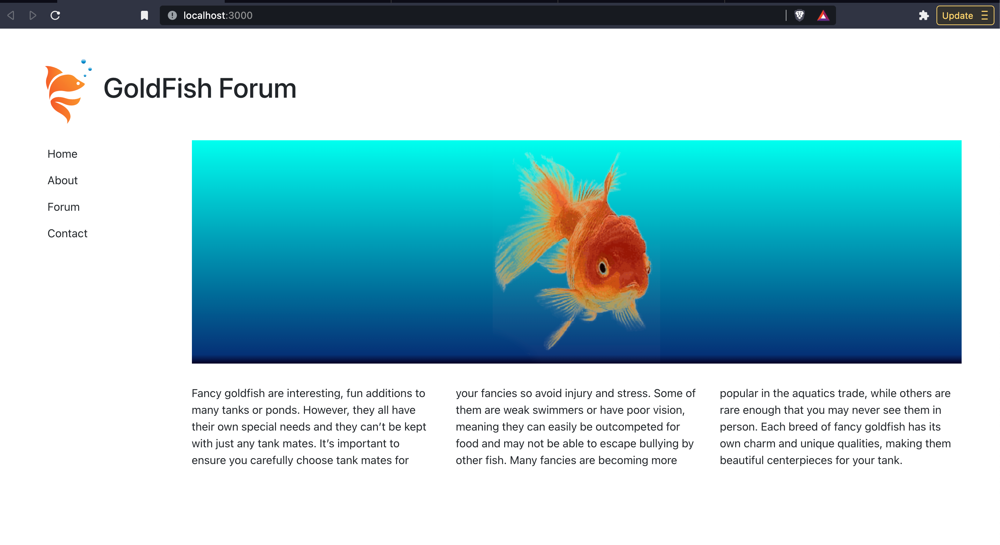

# Components Exercise



## Exercise overview

We are going to make an goldfish forum website page by combining different components each making up a different part of the page content.

## Setup a new Create-React-App project

1. Open VS code and then open your terminal from the menus at the top of the screen under `View > Terminal` or use the shortcut key **Ctrl+`**. 

2. In Terminal type `npx create-react-app goldfish-site`. Here we are naming our project goldfish-site. Wait while a new project is setup... It will display "Happy hacking!" when it's done.

3. Then in Terminal type `cd goldfish-site` to enter the project folder.

## Install Bootstrap

4. Next let's import Bootstrap a front-end framework that provides CSS code to make our project beautiful. In terminal type `npm i bootstrap@5.2.3`. This will install the package into our project.

## Start Node Test Server

5. In terminal type `npm start` to start a node test server this should open a new tab in your browser to **localhost:3000**.

## Import Bootstrap

6. Then in VS Code, open the **/src/index.js** file and import the bootstrap css like by typing the following line  `import 'bootstrap/dist/css/bootstrap.css';` placing it just after the import for ReactDOM and just before our import for **Index.css**. This way we can override the bootstrap styles with our own inside Index.css if we wish to.

## Exercise Assets

7. Move the image files from the */assets** folder outside the create-react-app project folder into the create-react-app folder */public/** this way the images will be accessible to your application.

## Install Simple React Snippets Extension

8. Next we will install the **Simple React Snippets** extension for VS Code. This will allow us to type short commands to generate blocks of common React code. Start by clicking the  **Extensions** icon from the panel on the left side of the screen.

9. In the search box at the top type `simple react snippets` and then click on the result labeled **Simple React Snippets** and then click **Install**.

## Creating the App Component

10. Open **/src/App.js**. This file is an example component that create-react-app starts with. You can delete everything in this file. Then at the top of the file you can import react by typing the shortcut `ffc` and press the **Tab** key. When the code appears start typing the class name `App`. It should fill in the for both the class name as well as in the default export command. This will create the following code:

```jsx
function App() {
  return (  );
}
 
export default App;
```

11. Write `<div>Hello World</div>` inside the `return` that is inside the App component.


12. Let's visit the **/src/index.js** file and look at how we are passing our component to ReactDOM to be rendered.

```jsx
import App from './App';
```

The line at the top of the file is importing the code from App.js so index.js has access to the App class.

```jsx
const root = ReactDOM.createRoot(document.getElementById('root'));
root.render(
  <React.StrictMode>
    <App />
  </React.StrictMode>
);
```

The render method of ReactDOM is being passed our `<App />` component. The `<React.StrictMode>` gives us better error reporting by activating additional checks and warnings.

13. Save your files and visit the browser. You should see "Hello World" displayed.

14. In VS Code, go back to the file **/src/App.js**. 

## Applying CSS Classes

15. Erase the text "Hello World" from inside the render method. Add the attribute `className=""` inside the `<div>` and give it the Bootstrap class name of `container-fluid`.

```jsx
function App() {
  return ( 
    <div className="container-fluid">

    </div>
  );
}
```

_Note: In the code above you can see I wrapped my JSX element inside `()` parenthesis. This acts as a grouping operator and simply allows us to not have to type a JSX tag on the same line as the `return` keyword. Instead we start our JSX on the next line. Some people prefer to write it this way so it looks cleaner, but it is not essential._

16. Inside the `<div>` lets create another two `<div>` and give them the Bootstrap class name of `row`. This will create our vertical separation between our header and the rest of the page.

I will also add some comments inside each div to make a note of what will eventually go there.

```jsx
function App() {
  return ( 
    <div className="container-fluid">
      <div className="row">
        {/* Header will go here... */}
      </div>
      <div className="row">
        {/* Sidebar will go here... */}
        {/* Main Content will go here... */}
      </div>
    </div>
  );
}
```

## Create Child Components

Let's create components for the Header, Sidebar, and Main content areas.

17. From the File Explorer in the left panel, **right-click** on the **/src/** folder inside your create-react-app-project. Select **New File** and name the file `Header.js`.

18. Create another file in the same location and name it `Sidebar.js`.

19. Create another file in the same location and name it `Main.js`.

## Working on the Header

20. Inside the **/src/Header.js** file, start by using the shortcut `ffc` and press **Tab** to create the functional component.

21. Type `Header` to name the component Header.

```jsx
function Header() {
    return (  );
}

export default Header;
```

22. Fill the empty return statement with `<header>`. Then add the Bootstrap class name `col-12` to `<header>`.

```jsx
<header className="col-12"></header>
```

23. Inside the `<header>` add an `` element and give it the class name of `logo`. Set a src pointing to the url `src="/goldfish-logo.svg"`. Set the alt attribute `alt="GoldFish Logo"`.

```jsx
<header className="col-12">
  
</header>
```

24. Below the logo image create a heading `<h1>GoldFish Forum</h1>`

```jsx
function Header() {
    return ( 
        <header className="col-12">
            
            <h1>GoldFish Forum</h1>
        </header>
    );
}

export default Header;
```

## Working on the Sidebar

25. Inside the **/src/Sidebar.js** file, start by using the shortcut `ffc` and press **Tab** to create the functional component

26. Type `Sidebar` to name the component Sidebar.

```jsx
function Sidebar(){
  return (

  );
}
 
export default Sidebar;
```

27. Fill the empty return statement with `<aside>`. Then add the Bootstrap class name `col-md-2` to `<aside>`.

```jsx
class Sidebar extends Component {
  render() { 
    return (
      <aside className="col-md-2">

      </aside>
    );
  }
}
```

28. Inside the `<aside>` create a `<ul>` unordered list. Fill it with the following list items:

```html
<ul>
  <li>Home</li>
  <li>About</li>
  <li>Forum</li>
  <li>Contact</li>
</ul>
```

Normally we would link these to the other views of our app but we will come back to **React Links** at another time. For now just leave them as just a list. Here is the finished Sidebar code.

```jsx
function Sidebar() {
    return ( 
        <aside className="col-md-2">
            <ul>
                <li>Home</li>
                <li>About</li>
                <li>Forum</li>
                <li>Contact</li>
            </ul>
        </aside>
    );
}

export default Sidebar;
```

## Working on the Main Content

29. Inside the **/src/Main.js** file, start by using the shortcut `ffc` and press **Tab** to create the functional component.

30. Type `Main` to name the component Main.

```jsx
function Main() {
  return (

  );
}
 
export default Main;
```

31. Fill the empty return statement with `<main>`. Then add the Bootstrap class name `col-md-10` to `<main>`.

```jsx
function Main() {
  return (
    <main className="col-md-10">
    </main>
  );
}
```

32. Inside the `<main>` element add a `<div>` with an `` inside of it. Below the `<div>` add a `<p>` paragraph.

```jsx
<main className="col-md-10">
  <div>
    
  </div>
  <p></p>
</main>
```

33. Set the `<div>` the class name of `frame`

34. Set the ``, `src=""` attribute to `/oranda.png` and the `alt=""` attribute set to `Oranda`.

35. Copy and Paste the following text into the `<p>`:

```txt
Fancy goldfish are interesting, fun additions to many tanks or ponds. However, they all have their own special needs and they can’t be kept with just any tank mates. It’s important to ensure you carefully choose tank mates for your fancies so avoid injury and stress. Some of them are weak swimmers or have poor vision, meaning they can easily be out competed for food and may not be able to escape bullying by other fish. Many fancies are becoming more popular in the aquatics trade, while others are rare enough that you may never see them in person. Each breed of fancy goldfish has its own charm and unique qualities, making them beautiful centerpieces for your tank.
```

Here is the updated code for Main:

```jsx
function Main() {

    return (  
        <main className="col-md-10">
            <div className="frame" style={frameStyle} >
                
            </div>
            <p>Fancy goldfish are interesting, fun additions to many tanks or ponds. However, they all have their own special needs and they can’t be kept with just any tank mates. It’s important to ensure you carefully choose tank mates for your fancies so avoid injury and stress. Some of them are weak swimmers or have poor vision, meaning they can easily be out competed for food and may not be able to escape bullying by other fish. Many fancies are becoming more popular in the aquatics trade, while others are rare enough that you may never see them in person. Each breed of fancy goldfish has its own charm and unique qualities, making them beautiful centerpieces for your tank.</p>
        </main>
    );
}
```

## Adding Inline CSS Style

As an alternative to using class names and an external stylesheet sometimes you may want to use inline style in order to make the style dynamic.

36. Inside the Main class before the render function we will add the following object with CSS styles:

```javascript
frameStyle = {
    background: 'rgb(2,0,36)',
    background: 'linear-gradient(0deg, rgba(2,0,36,1) 0%, rgba(9,49,121,1) 4%, rgba(0,255,239,1) 100%)'
  };
```

_Note: This CSS background gradient code was created using the free online tool [CSSGradient.io](https://cssgradient.io/)._

37. Then inside the `<div className="frame">` we will add the `style=""` attribute and pass in the `frameStyle` object.

```jsx
 <div className="frame" style={frameStyle}>
```

## Including Child Components In A Parent Component

We are ready to compose of all children components into out main parent component.

38. Open the file **/src/App.js** and at the top of the file after the React import, add the following import code for our component files:

```javascript
import Header from './Header';
import Sidebar from './Sidebar';
import Main from './Main';
```

39. Replace the comment `{/* Header will go here... */}` with a reference to our `<Header />` component. As you can see by making our class names Uppercase it makes it easier to tell the difference between the component `<Header />` vs the html element `<header>`.

40. Replace the comment`{/* Sidebar will go here... */}` with a reference to our `<Sidebar />` component.

41. Replace the comment `{/* Main content will go here... */}` with a reference to our `<Main />` component.

## CSS To Make Pretty

42. Inside **/src/App.js** at the top of the file below the other imports add the following line to import your `App.css` file

```javascript
import './App.css';
```

43. Open **/src/App.css** file. Delete all of the CSS in this file because we will be adding our own code.

44. Paste the following code into the CSS file:

```css
body {
  margin: 40px;
}

header {
  margin-bottom: 20px;
}

header, aside {
  text-align: center;
}

header img, header h1 {
  display: inline-block;
  vertical-align: top;
}

header h1 {
  margin-top: 20px;
}

.logo {
  width: 100px;
}

aside ul {
  list-style: none;
  padding-left: 20px;
}

aside li {
  padding: 7px 0;
}

main p {
  margin: 30px 0;
  column-count: auto;
  column-gap: 2em;
}

.frame {
  display: flex;
  align-items: center;
  justify-content: center;
}

@media only screen and (min-width: 753px) {
  header, aside {
    text-align: left;
  }
}

@media only screen and (min-width: 960px) {
  main p {
    column-count: 2;
  }
}

@media only screen and (min-width: 1172px) {
  main p {
    column-count: 3;
  }
}
```

46. Save all files and head to the browser to view your masterpiece.
